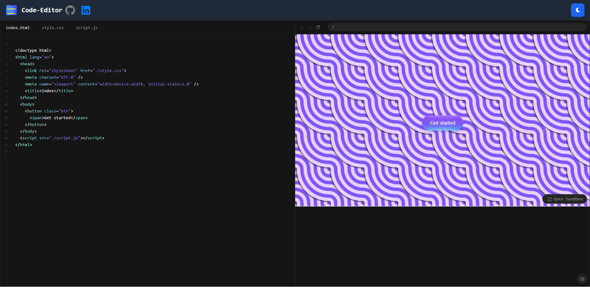

># _Code Editor_

> ## Description:- _A code edtor built with React, Vite, and flowbite CSS and Sandpack, by Soumabha Saha_.

> ### _App Preview_

> ### Libraries required for this project

| Icon                                                                          | Technology                                    | Category              |
| ----------------------------------------------------------------------------- | --------------------------------------------- | --------------------- |
|                               | [Vite](https://vite.dev/)                     | **Build tool**        |
|                                  | [React](https://react.dev/)                   | **UI building**       |
|  | [Tailwind CSS](https://tailwindcss.com/)      | **CSS frameWork**     |
|                  | [Flowbite React](https://flowbite-react.com/) | **Component library** |
|             | [sandpack](https://sandpack.codesandbox.io/)  | **Code editor**       |
